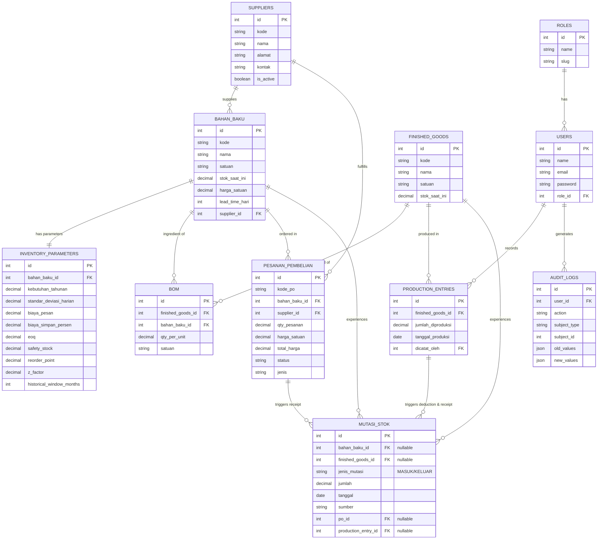

# Buku Panduan Lengkap & Dokumentasi Sistem CV Akuna

**Inventory Management System CV Akuna** adalah solusi perangkat lunak terintegrasi yang dirancang khusus untuk menangani proses logistik, pemesanan bahan baku cerdas, dan pencatatan produksi dengan perlindungan tingkat lanjut terhadap stok negatif. 

Buku panduan ini merupakan sumber kebenaran tunggal (*Single Source of Truth*) yang menggabungkan panduan teknis operasional bagi pengembang (Developer) dan panduan penggunaan harian bagi Karyawan maupun Owner.

---

## Bab 1: Halaman Utama & Pendahuluan

Sistem Inventory CV Akuna membagi fungsi ke dalam dua kokpit utama berdasarkan peran (*Role-based Access*):

1. **Kokpit Karyawan (Operator Logistik)**
   Berfungsi sebagai jantung operasional sistem. Meliputi manajemen data master (Bahan Baku, Supplier, Barang Jadi, Resep/BOM), transaksi mutasi stok (masuk/keluar/penyesuaian), proses pencatatan produksi yang terhubung dengan resep BOM secara otomatis, serta pemesanan pembelian (PO) berbasis algoritma deteksi stok cerdas.
2. **Kokpit Owner (Pemilik/Manajer)**
   Berfungsi sebagai pusat pemantauan analitik dan pengawasan. Meliputi *Dashboard* statistik finansial stok, kemampuan mencetak laporan valuasi aset dan performa logistik (PDF), pengelolaan akun karyawan (User Management), hingga penyesuaian parameter rumus penghitungan sistem (*System Settings*).

---

## Bab 2: Tech Stack & Panduan Deployment

### Teknologi Utama (Tech Stack)
Aplikasi ini dikembangkan dengan arsitektur **Modular Monolith** yang berfokus pada kecepatan rendering, interaktivitas, dan keandalan data transaksi.
*   **Backend:** Laravel 12 (berjalan di atas PHP 8.2/8.4).
*   **Frontend:** Livewire 3 (untuk interaktivitas berbasis komponen tanpa *page-reload* penuh), Alpine.js (untuk transisi dan UI *state* mikro), dan Tailwind CSS (untuk penataan gaya/CSS yang modern dan responsif).
*   **Database:** MySQL / SQLite (untuk tahap pengembangan lokal), dan PostgreSQL (untuk tahap produksi).
*   **Engine PDF:** `barryvdh/laravel-dompdf` digunakan untuk mencetak laporan (Masa depan: akan digabungkan dengan Supabase Storage untuk penyimpanan berkas).

### Panduan Deployment Lokal (Langkah demi Langkah)
Bagi pengembang baru yang ingin menjalankan aplikasi ini di komputer lokal:

1. **Kloning Repositori:**
   ```bash
   git clone https://github.com/Garethgareth26/inventorymanagementsystem.git
   cd inventory-management-system-akuna
   ```
2. **Instalasi Dependensi PHP & Node:**
   ```bash
   composer install
   npm install && npm run build
   ```
3. **Konfigurasi Lingkungan (Environment):**
   Salin file `.env.example` menjadi `.env`.
   ```bash
   cp .env.example .env
   php artisan key:generate
   ```
   *Atur konfigurasi database (DB_CONNECTION, DB_DATABASE, dll) di file `.env` sesuai server lokal Anda (misal menggunakan MySQL XAMPP atau SQLite).*
4. **Migrasi Database & Seeding Data:**
   ```bash
   php artisan migrate:fresh --seed
   ```
   *(Perintah ini akan membuat semua struktur tabel dan mengisi data awal seperti akun karyawan, owner, dan data master dummy).*
5. **Jalankan Aplikasi:**
   ```bash
   php artisan serve
   ```
   Akses aplikasi di browser melalui URL: `http://127.0.0.1:8000`

### Rancangan Arsitektur Deployment Masa Depan
Untuk ketahanan (*scalability*) tingkat tinggi, aplikasi dirancang untuk di-*deploy* menggunakan ekosistem *Cloud Native*:
*   **Google Cloud Run:** Aplikasi akan di-Bungkus (Dockerized) ke dalam *container* dan dijalankan di atas GCP Cloud Run yang dapat *scale-to-zero* dan *auto-scale* berdasarkan lalu lintas (*traffic*).
*   **Supabase:** Menggantikan database server tradisional. Supabase akan bertindak sebagai *Database as a Service* (PostgreSQL) sekaligus tempat penyimpanan awan (Supabase Storage) untuk menyimpan cetakan Laporan PDF maupun foto barang (jika ada).

---

## Bab 3: Arsitektur Database & Skema ERD

Aplikasi ini menggunakan pendekatan relasional yang ketat untuk menjamin konsistensi data (*Atomic Stock Protection*). Berikut adalah daftar entitas utamanya:

*   **users & roles**: Sistem otentikasi. Setiap pengguna (*User*) memiliki satu peran (*Role*), yakni Owner atau Karyawan.
*   **bahan_baku**: Menyimpan master data bahan mentah, terhubung ke *Supplier*.
*   **finished_goods**: Menyimpan master data barang hasil produksi.
*   **suppliers**: Menyimpan data pemasok. Memiliki logika perhitungan *Lead Time* otomatis.
*   **inventory_parameters**: Ekstensi dari tabel bahan baku. Menyimpan variabel rumus perhitungan tingkat lanjut (SS, EOQ, ROP).
*   **bom (Bill of Materials)**: Tabel penghubung (*pivot*) antara Barang Jadi dan Bahan Baku yang merinci resep produksi (Berapa gram gula untuk 1 potong kue?).
*   **pesanan_pembelian (PO)**: Mencatat pesanan dari perusahaan ke Supplier, memuat jenis pesanan (Rutin/Darurat).
*   **production_entries**: Mencatat kejadian produksi (Kapan dan berapa banyak diproduksi?).
*   **mutasi_stok**: Tabel *Ledger* (Buku Besar) yang paling krusial. Segala aktivitas yang menambah/mengurangi stok Bahan Baku atau Barang Jadi akan tercatat abadi di sini. Tidak ada stok yang berubah tanpa terekam di tabel ini.
*   **audit_logs**: Menyimpan riwayat aktivitas penting (Siapa melakukan apa dan kapan).
*   **system_settings**: Menyimpan variabel konfigurasi global (*z-factor*, *surcharge* PO Darurat, dll).

### Visualisasi Skema Database (ERD)



---

## Bab 4: Panduan Penggunaan (User Manual)

### Akses Sistem
Untuk mengakses sistem, buka browser Anda (disarankan Google Chrome) dan kunjungi:
👉 **URL Akses:** `http://localhost:8000` (atau IP/Domain server tempat di-*deploy*)

**Kredensial Akun Default (Uji Coba):**
*   **Masuk sebagai Owner:**
    *   Email: `owner@akuna.com`
    *   Password: `password`
*   **Masuk sebagai Karyawan:**
    *   Email: `karyawan@akuna.com`
    *   Password: `password`

---

### A. Panduan Khusus Karyawan (Operator Logistik)

1. **Manajemen Data Master (Supplier & Bahan Baku)**
   *   **Menambah Supplier:** Buka menu `Supplier`. Klik "Tambah". Masukkan data profil. Perlu diketahui, alamat yang Anda ketik akan dibaca oleh sistem pintar (Contoh: "Jakarta" = maksimal 2 hari, "Jogja/Sleman" = maksimal 1 hari pengiriman).
   *   **Menambah Bahan Baku:** Buka menu `Bahan Baku`. Klik "Tambah Bahan Baku". Saat Anda menautkannya ke Supplier tertentu, kolom *Lead Time* akan otomatis terkunci pada batas maksimal wilayah Supplier tersebut untuk mencegah input data yang keliru.

2. **Mencatat Penyesuaian Stok (Stock Opname)**
   Jika terjadi kehilangan barang atau selisih fisik gudang:
   *   Buka menu `Penyesuaian Stok`.
   *   Pilih Material (Bahan Baku / Barang Jadi).
   *   Tentukan jenis mutasi (Masuk atau Keluar), isi jumlahnya dan alasannya (misal: "Barang kedaluwarsa").
   *   *Sistem memiliki peringatan cerdas:* Jika Anda mengurangi stok melebihi 3x rata-rata pemakaian bulanan, sistem akan memblokirnya sampai Anda mencentang tombol "Konfirmasi Kesengajaan".

3. **Simulasi Perhitungan Cerdas (Safety Stock & EOQ)**
   Sistem diatur oleh algoritma *Economic Order Quantity* (Kuantitas Pesanan Ekonomis) dan *Safety Stock*. Karyawan dapat melihat simulasi matematika di balik angka-angka tersebut:
   *   Buka menu `Kalkulator ROP & Stok Pengaman`.
   *   Pilih Bahan Baku. Anda akan melihat secara langsung penjabaran rumus `(Z-Factor × Standar Deviasi × Akar Lead Time)`. Angka-angka ini akan selalu beradaptasi sesuai pemakaian bahan baku per bulan!

4. **Pencatatan Entri Produksi (Auto-Deduction)**
   Buka menu `Entri Produksi`. 
   *   Pilih Barang Jadi (misal "Kue Sus") dan masukkan jumlah yang akan diproduksi.
   *   Sistem akan secara otomatis "membedah" BOM (Resep) dari Kue Sus tersebut.
   *   **Catatan Kritis:** Sistem dilengkapi proteksi tingkat *Database*. Jika Anda memaksa memproduksi 100 Kue Sus namun ternyata terigu di gudang hanya cukup untuk 90 kue, sistem akan langsung menolak proses tersebut dan menampilkan peringatan. Hal ini mencegah terjadinya *Negative Stock* (Stok Minus) di sistem.

5. **Pemesanan Pembelian (Purchase Order / PO)**
   *   **PO Rutin:** Buka menu `Pesanan Pembelian`, klik Buat Baru. Jenis pesanan Rutin menggunakan harga standar material.
   *   **PO Darurat:** Dapat diakses dengan mudah melalui ikon Notifikasi Lonceng (di kanan atas) yang menyala merah jika ada stok menyentuh titik *Reorder Point*. Atau lewat *Live Critical Stock Alert* di Dashboard. PO Darurat ini memperhitungkan biaya ekstra darurat (Surcharge) secara otomatis pada harga pesanan.

---

### B. Panduan Khusus Owner (Pemilik/Manajer)

1. **Pemantauan Dashboard & Analisis**
   *   Begitu Login, Owner disuguhkan laporan grafis komprehensif (*Donut Chart* untuk Analisis ABC, dsb).
   *   Owner hanya berhak *melihat* (Read-Only) data logistik, sehingga meminimalisir kesalahan campur tangan (*human error*) dari pihak manajemen ke operasional Karyawan.

2. **Pelaporan (Cetak PDF)**
   *   Buka menu `Laporan`.
   *   Anda dapat menyaring periode (Misal: Awal bulan ini hingga Akhir bulan).
   *   Laporan memuat metrik penting: Total Valuasi Aset (*Uang mati di gudang*), Rekap Mutasi, hingga Analisis Performa Keterlambatan Supplier. Klik **Export PDF** untuk mengunduh laporan secara instan.

3. **Pengaturan Sistem (System Settings)**
   *   Buka menu `Pengaturan Sistem`.
   *   Di sini Owner mengontrol arah kebijakan perusahaan.
   *   **Parameter ABC Threshold:** Kapan sebuah barang dianggap Kelas A (Barang Mahal/Penting) atau Kelas C.
   *   **Emergency Surcharge:** Berapa persen biaya tambahan darurat yang otomatis dikenakan ke HPP Karyawan jika melakukan PO Darurat.
   *   **Nilai Z-Factor (Service Level):** Mengatur ketatnya target kepuasan logistik (Default: 1.65 untuk kepuasan 95%). Jika stok pengaman (*Safety stock*) dirasa terlalu banyak, Anda bisa menurunkan *Z-Factor* di menu ini, dan seluruh rumus di aplikasi Karyawan akan ikut menyesuaikan secara terpusat!

4. **Manajemen Pengguna (Manajemen Karyawan)**
   *   Buka menu `Manajemen Karyawan`.
   *   Owner bebas menambah, mengedit, dan me-nonaktifkan akun Karyawan.
   *   *(Fitur Proteksi):* Sistem tidak mengizinkan Owner untuk menghapus Karyawan yang pernah melakukan riwayat mutasi/produksi, demi menjaga integritas pembukuan sistem di masa depan. Sebagai gantinya, akun tersebut hanya bisa "di-nonaktifkan" agar tidak bisa login.

---
*Buku Panduan ini bersifat final dan siap didistribusikan kepada pemangku kepentingan (Stakeholders) CV Akuna.*
