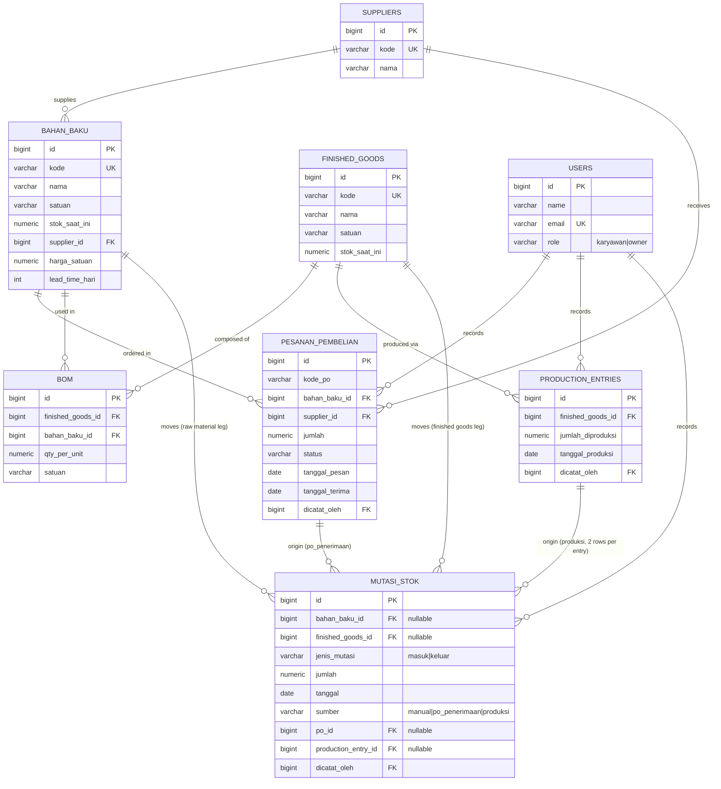

# Database Design Document — BOM & Production Module
## Sistem Inventori CV Akuna — v1.0

| Info | Keterangan |
|---|---|
| Versi Dokumen | 1.0 |
| Tanggal | 4 Juli 2026 |
| Basis | Domain Model Revision Addendum (BOM & Production), approved 4 Juli 2026 |
| Status | Approved — domain model frozen, proceeding to implementation-ready schema |
| Target Stack | Laravel (migrations/Eloquent) + PostgreSQL |
| Scope of this document | Full schema for BOM/Production module; **existing tables reconstructed as assumptions** where this addendum did not itself define them (see Section 1) |

---

## 1. Assumptions Carried Into This Design (Please Verify)

The addendum fully specifies four things: `finished_goods`, `bom`, `production_entries`, and the revision to `mutasi_stok`. It does **not** re-specify `bahan_baku`, `pesanan_pembelian`, `users`, or `suppliers` field-by-field — those are only described narratively in the SAD v1.0 / Domain Analysis Report v1.0. To produce a schema that actually compiles and migrates, I reconstructed minimal, plausible versions of those tables. Treat every field below marked **(assumed)** as needing a quick check against your actual SAD/Domain Analysis Report field lists before you run the migrations — if the real tables differ, only the FK targets need adjusting; nothing about the BOM/Production design itself depends on the exact shape of these fields.

| Table | Status |
|---|---|
| `users` | **(assumed)** minimal shape: role-based (karyawan/owner), per SAD Section 6 RBAC |
| `suppliers` | **(assumed)** minimal shape, referenced by "routine-supplier price and lead time" |
| `bahan_baku` | **(assumed)** minimal shape sufficient to support EOQ/ROP/SS/SD/D calc engine references; the calc engine's own parameter fields (D, SD, EOQ, ROP, SS) are **not** re-derived here — out of scope for this addendum, assumed to live in `bahan_baku` or a separate parameter table per ADR-004 |
| `pesanan_pembelian` | **(assumed)** flat, header-less shape per Domain Analysis Report Section 3.4; status values (`Draft`/`Dipesan`/`Diterima`/`Dibatalkan`) are a guess at the enum — confirm actual values |
| `finished_goods` | **Fully specified by this addendum** (Section 3.1) |
| `bom` | **Fully specified by this addendum** (Section 3.1) |
| `production_entries` | **Fully specified by this addendum** (Section 3.1) |
| `mutasi_stok` | **Existing table, revised by this addendum** — base columns assumed, new columns (`sumber`, `po_id`, `production_entry_id`) fully specified (Section 3.2) |

---

## 2. Entity-Relationship Diagram



Renders on GitHub and any Mermaid-compatible viewer. A dbdiagram.io-native version is provided separately as `schema.dbml`.

---

## 3. Design Decisions Baked Into This Schema

1. **Two nullable FKs, not a polymorphic reference, on `mutasi_stok`.** `bahan_baku_id` and `finished_goods_id` are both nullable columns with real foreign keys, enforced mutually exclusive by a `CHECK` constraint (`num_nonnulls(...) = 1`). This keeps referential integrity inside PostgreSQL rather than relegating it to application code, at the cost of two FK columns instead of one polymorphic pair. Flag if you'd prefer the polymorphic `item_type`/`item_id` pattern instead.
2. **`sumber` consistency is DB-enforced, not just documented.** A `CHECK` constraint ties `sumber = 'po_penerimaan'` to a non-null `po_id` (and null `production_entry_id`), and `sumber = 'produksi'` to a non-null `production_entry_id` (and null `po_id`). `sumber = 'manual'` requires both null. This makes the audit-trail requirement (PRD Section 7) structurally impossible to violate rather than merely conventional.
3. **Stock balances are denormalized onto `bahan_baku.stok_saat_ini` / `finished_goods.stok_saat_ini`.** `mutasi_stok` is the ledger of truth for *how* stock moved, but current stock is kept as a running total on the master row (as the original domain model implies) rather than computed via `SUM()` on every read. This means every mutation write must update the master row's balance **inside the same transaction** — see Section 6.
4. **BOM uniqueness.** `(finished_goods_id, bahan_baku_id)` is unique on `bom` — a raw material can't appear twice in one product's active recipe. Combined with "single active BOM per finished good" (approved Decision 2), this means `bom` rows are simply replaced/edited in place on recipe change; no versioning table.
5. **Insufficient-stock blocking (approved Decision 1) is an application-layer validation, not a DB constraint**, because it requires reading `qty_per_unit × jumlah_diproduksi` across all BOM lines and comparing against current stock *before* any write — a `CHECK` constraint can't express that. See Section 6 for where this lives in the transaction.
6. **No BOM versioning table**, per approved Decision 2 — `mutasi_stok` rows generated by `production_entries` are immutable and are the historical record.

---

## 4. Data Dictionary

### 4.1 `users` (assumed, pre-existing)
| Column | Type | Null | Default | Constraints | Description |
|---|---|---|---|---|---|
| id | bigint | No | — | PK | |
| name | varchar(150) | No | — | | |
| email | varchar(150) | No | — | UNIQUE | |
| password | varchar(255) | No | — | | Laravel hashed password |
| role | varchar(20) | No | — | CHECK IN ('karyawan','owner') | Drives capability map (SAD §6) |
| created_at / updated_at | timestamp | Yes | now() | | |

### 4.2 `suppliers` (assumed, pre-existing)
| Column | Type | Null | Default | Constraints | Description |
|---|---|---|---|---|---|
| id | bigint | No | — | PK | |
| kode | varchar(30) | No | — | UNIQUE | |
| nama | varchar(150) | No | — | | |
| alamat | text | Yes | null | | |
| kontak | varchar(100) | Yes | null | | |
| created_at / updated_at | timestamp | Yes | now() | | |

### 4.3 `bahan_baku` (assumed, pre-existing)
| Column | Type | Null | Default | Constraints | Description |
|---|---|---|---|---|---|
| id | bigint | No | — | PK | |
| kode | varchar(30) | No | — | UNIQUE | |
| nama | varchar(150) | No | — | | |
| satuan | varchar(20) | No | — | | |
| stok_saat_ini | numeric(15,2) | No | 0 | CHECK ≥ 0 | Running balance; updated by every `mutasi_stok` write touching this row |
| supplier_id | bigint | Yes | null | FK → suppliers.id | Routine supplier for EOQ/ROP inputs |
| harga_satuan | numeric(15,2) | Yes | null | | Routine-supplier price, per Domain Analysis Report §2.3 |
| lead_time_hari | int | Yes | null | | Routine-supplier lead time |
| created_at / updated_at | timestamp | Yes | now() | | |

*EOQ/D/SD/SS/ROP calculated parameters are assumed to live elsewhere (own table per ADR-004) and are out of scope for this document.*

### 4.4 `pesanan_pembelian` (assumed, pre-existing)
| Column | Type | Null | Default | Constraints | Description |
|---|---|---|---|---|---|
| id | bigint | No | — | PK | |
| kode_po | varchar(30) | No | — | | |
| bahan_baku_id | bigint | No | — | FK → bahan_baku.id | |
| supplier_id | bigint | No | — | FK → suppliers.id | |
| jumlah | numeric(15,2) | No | — | CHECK > 0 | |
| status | varchar(20) | No | 'Draft' | CHECK IN ('Draft','Dipesan','Diterima','Dibatalkan') | **Confirm actual enum values** |
| tanggal_pesan | date | No | — | | |
| tanggal_terima | date | Yes | null | | Set when status → Diterima; triggers `mutasi_stok` insert |
| dicatat_oleh | bigint | No | — | FK → users.id | |
| created_at / updated_at | timestamp | Yes | now() | | |

### 4.5 `finished_goods` — NEW (fully specified by addendum)
| Column | Type | Null | Default | Constraints | Description |
|---|---|---|---|---|---|
| id | bigint | No | — | PK | |
| kode | varchar(30) | No | — | UNIQUE | |
| nama | varchar(150) | No | — | | |
| satuan | varchar(20) | No | — | | |
| stok_saat_ini | numeric(15,2) | No | 0 | CHECK ≥ 0 | Running balance, credited by production |
| created_at / updated_at | timestamp | Yes | now() | | |

### 4.6 `bom` — NEW (fully specified by addendum)
| Column | Type | Null | Default | Constraints | Description |
|---|---|---|---|---|---|
| id | bigint | No | — | PK | |
| finished_goods_id | bigint | No | — | FK → finished_goods.id, ON DELETE RESTRICT | |
| bahan_baku_id | bigint | No | — | FK → bahan_baku.id, ON DELETE RESTRICT | |
| qty_per_unit | numeric(15,4) | No | — | CHECK > 0 | Raw material required per 1 unit of finished good |
| satuan | varchar(20) | No | — | | Unit for `qty_per_unit` (may differ from `bahan_baku.satuan` if a conversion is applied — confirm whether conversion logic is needed) |
| created_at / updated_at | timestamp | Yes | now() | | |
| — | — | — | — | UNIQUE (finished_goods_id, bahan_baku_id) | One line per material per product (single active BOM, Decision 2) |

### 4.7 `production_entries` — NEW (fully specified by addendum)
| Column | Type | Null | Default | Constraints | Description |
|---|---|---|---|---|---|
| id | bigint | No | — | PK | |
| finished_goods_id | bigint | No | — | FK → finished_goods.id | |
| jumlah_diproduksi | numeric(15,2) | No | — | CHECK > 0 | |
| tanggal_produksi | date | No | — | | |
| dicatat_oleh | bigint | No | — | FK → users.id | Karyawan only, per RBAC (`production.record`) |
| created_at / updated_at | timestamp | Yes | now() | | |

*No `status` column: per Decision 1, an entry that fails the stock check is rejected before any row is written — there is no "failed" state to persist.*

### 4.8 `mutasi_stok` — REVISED (existing table, new columns marked)
| Column | Type | Null | Default | Constraints | Description |
|---|---|---|---|---|---|
| id | bigint | No | — | PK | |
| bahan_baku_id | bigint | Yes | null | FK → bahan_baku.id | Set only for raw-material legs |
| finished_goods_id | bigint | Yes | null | FK → finished_goods.id | Set only for finished-goods legs |
| jenis_mutasi | varchar(10) | No | — | CHECK IN ('masuk','keluar') | |
| jumlah | numeric(15,2) | No | — | CHECK > 0 | |
| tanggal | date | No | — | | |
| **sumber** | varchar(20) | No | — | CHECK IN ('manual','po_penerimaan','produksi') | **NEW** — origin type (§3.2 of addendum) |
| **po_id** | bigint | Yes | null | FK → pesanan_pembelian.id | **NEW** — set only when sumber = po_penerimaan |
| **production_entry_id** | bigint | Yes | null | FK → production_entries.id | **NEW** — set only when sumber = produksi |
| dicatat_oleh | bigint | No | — | FK → users.id | |
| keterangan | text | Yes | null | | |
| created_at / updated_at | timestamp | Yes | now() | | |

**Table-level CHECK constraints on `mutasi_stok`:**
```sql
ALTER TABLE mutasi_stok ADD CONSTRAINT chk_mutasi_item_exclusive
  CHECK (num_nonnulls(bahan_baku_id, finished_goods_id) = 1);

ALTER TABLE mutasi_stok ADD CONSTRAINT chk_mutasi_sumber_consistency
  CHECK (
    (sumber = 'manual' AND po_id IS NULL AND production_entry_id IS NULL)
    OR (sumber = 'po_penerimaan' AND po_id IS NOT NULL AND production_entry_id IS NULL)
    OR (sumber = 'produksi' AND production_entry_id IS NOT NULL AND po_id IS NULL)
  );
```

---

## 5. Indexes

Beyond the primary/foreign keys above:

```sql
CREATE INDEX idx_mutasi_bahan_baku_tanggal ON mutasi_stok (bahan_baku_id, tanggal) WHERE bahan_baku_id IS NOT NULL;
CREATE INDEX idx_mutasi_finished_goods_tanggal ON mutasi_stok (finished_goods_id, tanggal) WHERE finished_goods_id IS NOT NULL;
CREATE INDEX idx_mutasi_jenis_sumber ON mutasi_stok (jenis_mutasi, sumber);
CREATE INDEX idx_bom_finished_goods ON bom (finished_goods_id);
CREATE INDEX idx_bom_bahan_baku ON bom (bahan_baku_id);
CREATE INDEX idx_production_finished_goods_tanggal ON production_entries (finished_goods_id, tanggal_produksi);
```

The two partial indexes on `mutasi_stok` matter most: the monthly-usage aggregation (`Pemakaian Bulanan` → `D`/`SD`/EOQ/SS/ROP chain, addendum §3.3) runs `WHERE bahan_baku_id = ? AND jenis_mutasi = 'keluar' AND tanggal BETWEEN ...` for every raw material, every period — this is now a hot query path once production entries go live.

---

## 6. Atomicity Implementation (Laravel)

This is the one requirement from the addendum (§4.2) that has to survive into actual code, not just the schema. Two things are required, not one:

1. **A single DB transaction** wrapping the stock check, the production entry insert, both `mutasi_stok` inserts, and both master-row balance updates — so a failure anywhere rolls everything back.
2. **Row-level locking** on the `bahan_baku` rows being deducted, so two production entries running concurrently against the same material can't both pass the stock check and jointly drive stock negative (a transaction alone doesn't prevent this race).

```php
public function recordProduction(int $finishedGoodsId, float $jumlahDiproduksi, int $userId): ProductionEntry
{
    return DB::transaction(function () use ($finishedGoodsId, $jumlahDiproduksi, $userId) {

        $finishedGoods = FinishedGoods::findOrFail($finishedGoodsId);
        $bomLines = Bom::where('finished_goods_id', $finishedGoodsId)->get();

        // Lock the raw-material rows involved, in a stable order, to avoid deadlocks
        // between concurrent production entries touching overlapping BOM lines.
        $bahanBakuIds = $bomLines->pluck('bahan_baku_id')->sort()->values();
        $bahanBakuLocked = BahanBaku::whereIn('id', $bahanBakuIds)
            ->orderBy('id')
            ->lockForUpdate()
            ->get()
            ->keyBy('id');

        // Validate BEFORE writing anything (Decision 1: block on insufficient stock).
        foreach ($bomLines as $line) {
            $required = $line->qty_per_unit * $jumlahDiproduksi;
            $bb = $bahanBakuLocked[$line->bahan_baku_id];
            if ($bb->stok_saat_ini < $required) {
                throw new InsufficientStockException(
                    "Stok {$bb->nama} tidak mencukupi: butuh {$required}, tersedia {$bb->stok_saat_ini}."
                );
            }
        }

        $entry = ProductionEntry::create([
            'finished_goods_id' => $finishedGoodsId,
            'jumlah_diproduksi' => $jumlahDiproduksi,
            'tanggal_produksi'  => now()->toDateString(),
            'dicatat_oleh'      => $userId,
        ]);

        foreach ($bomLines as $line) {
            $required = $line->qty_per_unit * $jumlahDiproduksi;
            $bb = $bahanBakuLocked[$line->bahan_baku_id];

            MutasiStok::create([
                'bahan_baku_id'        => $bb->id,
                'jenis_mutasi'         => 'keluar',
                'jumlah'               => $required,
                'tanggal'              => $entry->tanggal_produksi,
                'sumber'               => 'produksi',
                'production_entry_id'  => $entry->id,
                'dicatat_oleh'         => $userId,
            ]);

            $bb->decrement('stok_saat_ini', $required);
        }

        MutasiStok::create([
            'finished_goods_id'    => $finishedGoods->id,
            'jenis_mutasi'         => 'masuk',
            'jumlah'               => $jumlahDiproduksi,
            'tanggal'              => $entry->tanggal_produksi,
            'sumber'               => 'produksi',
            'production_entry_id'  => $entry->id,
            'dicatat_oleh'         => $userId,
        ]);

        $finishedGoods->increment('stok_saat_ini', $jumlahDiproduksi);

        return $entry;
    });
}
```

If any step throws (including the `InsufficientStockException`), `DB::transaction` rolls back everything — no orphaned `production_entries` row, no partial `mutasi_stok` pair, no stale stock decrement. This is the concrete mechanism behind the addendum's atomicity requirement; it belongs in a service class (e.g. `ProductionService`), not the controller, so it's the single code path anything calling production entry creation goes through.

---

## 7. Migration Order

For a fresh install, migrations must run in this dependency order:

1. `users`
2. `suppliers`
3. `bahan_baku` (FK → suppliers)
4. `finished_goods`
5. `pesanan_pembelian` (FK → bahan_baku, suppliers, users)
6. `bom` (FK → finished_goods, bahan_baku)
7. `production_entries` (FK → finished_goods, users)
8. `mutasi_stok` (FK → bahan_baku, finished_goods, pesanan_pembelian, production_entries, users)

If `mutasi_stok` already exists in your codebase (pre-BOM/Production), add a follow-up migration instead of recreating it:

```php
Schema::table('mutasi_stok', function (Blueprint $table) {
    $table->foreignId('finished_goods_id')->nullable()->after('bahan_baku_id')->constrained('finished_goods');
    $table->string('sumber', 20)->default('manual')->after('tanggal');
    $table->foreignId('po_id')->nullable()->after('sumber')->constrained('pesanan_pembelian');
    $table->foreignId('production_entry_id')->nullable()->after('po_id')->constrained('production_entries');
});

DB::statement('ALTER TABLE mutasi_stok ADD CONSTRAINT chk_mutasi_item_exclusive CHECK (num_nonnulls(bahan_baku_id, finished_goods_id) = 1)');
DB::statement("ALTER TABLE mutasi_stok ADD CONSTRAINT chk_mutasi_sumber_consistency CHECK (
    (sumber = 'manual' AND po_id IS NULL AND production_entry_id IS NULL)
    OR (sumber = 'po_penerimaan' AND po_id IS NOT NULL AND production_entry_id IS NULL)
    OR (sumber = 'produksi' AND production_entry_id IS NOT NULL AND po_id IS NULL)
)");
```

Note: existing `mutasi_stok` rows predating this migration will have `bahan_baku_id` set, `finished_goods_id` null, and need a backfilled `sumber` value (`'manual'` is the safe default for historical rows unless you can distinguish them from historical PO receipts).

---

## 8. RBAC Note (no schema impact, included for completeness)

`production.record` capability → mapped to `karyawan` only in `config/capabilities.php`, per addendum §4.3. This is enforced at the application/policy layer, not the database — no DB column encodes it. Flagging only so it isn't missed during implementation since it doesn't show up anywhere in the schema itself.

---

## 9. Open Items to Confirm

These don't block starting implementation, but the schema decisions above rest on them:

1. **`pesanan_pembelian.status` enum values** — I used `Draft/Dipesan/Diterima/Dibatalkan` as a placeholder; confirm against the real PRD/SAD text.
2. **`bahan_baku` and `suppliers` full field lists** — confirm nothing beyond what's listed here (e.g. contact fields, categories) exists in the real domain model, since those would need adding to migrations before go-live.
3. **`bom.satuan` vs `bahan_baku.satuan`** — confirmed whether a unit-conversion step is needed when a BOM line's unit differs from the raw material's stock-keeping unit, or whether they're always identical in practice.
